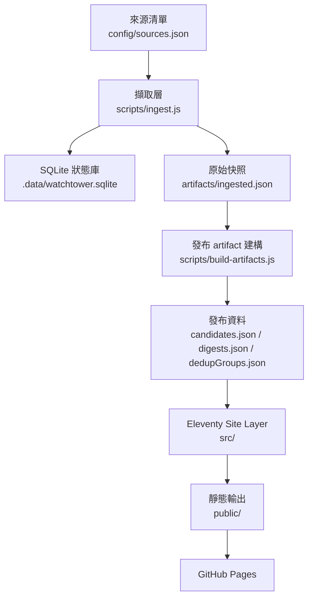
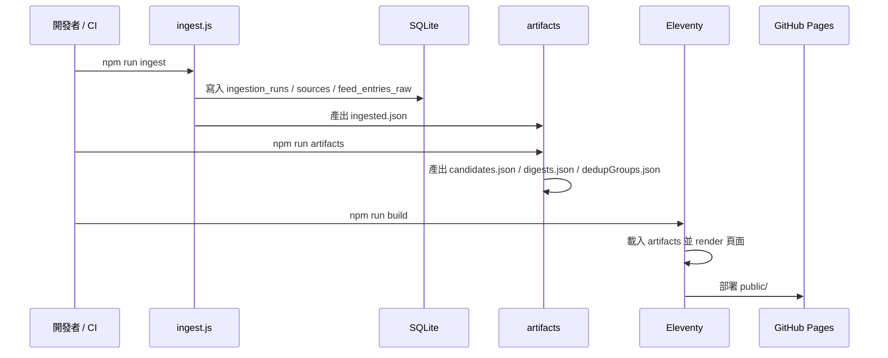
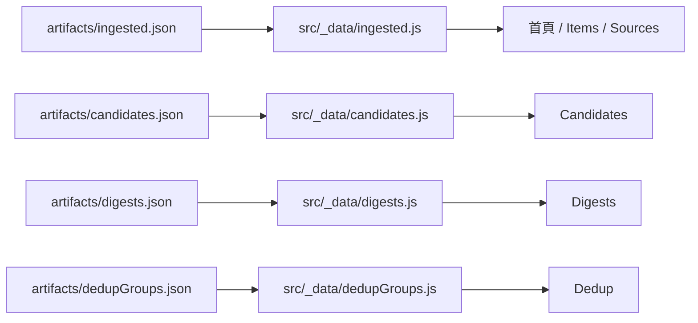

# ai-watchtower

`ai-watchtower` 不是單純的 AI 新聞站，也不是一般的 RSS reader。

它的目標是把高噪音、分散、容易造成焦慮的 AI 資訊流，轉成一套**可驗證、可回看、可判斷**的個人 intelligence publishing system。

## 專案定位

這個專案目前的核心不是「做一個互動很多的前端框架應用」，而是：

- 穩定抓取高價值來源
- 用 deterministic pipeline 做 normalization / dedup / classification / scoring
- 產出可重建、可檢查的 artifacts
- 以靜態網站方式發布每日 intelligence surface

換句話說，這是一個**artifact-first 的情報出版系統**。

## 目前技術決策

### 前端

目前前端仍採用 **Eleventy + Nunjucks (`.njk`)**，沒有先搬到 React / Next.js / Astro。

這個決策是刻意的，理由如下：

- 目前主要需求是「資訊架構、掃讀性、信任感、可驗證性」，不是 client-side 複雜互動
- 專案本身的資料邊界已經很清楚：`pipeline -> artifacts -> static publish`
- GitHub Pages 與靜態輸出非常適合現在的部署模型
- 現階段先把 artifact contract 與 publishing surface 做穩，比整站改框架更有價值

未來如果要加入更強的互動式篩選、視覺化時間軸、watchlist、使用者工作台，再評估：

- `Eleventy + islands`
- `Astro`
- 或真正升級成完整 app framework

### UI / UX 方向

目前 UI 已往 **情報台 / intelligence console** 的方向調整，而不是一般 landing page。

重點是：

- 首頁先給你「今日狀態」而不是行銷文案
- 先看 signal、再看 raw feed
- 把 ranked / cluster / source health / latest ingest 分成不同工作面
- 視覺上偏向 editorial intelligence desk，而不是一般 SaaS dashboard

## 系統架構

### 高層架構圖



### 執行流程圖



### Site Layer 關係圖



## 設計原則

### 1. Artifact-first

先產資料，再渲染網站。

- pipeline 先輸出 artifacts
- site 只讀 artifacts
- deploy 只發布靜態結果

### 2. Deterministic-first

現階段優先建立穩定、可回放、可追蹤的 deterministic 基礎。

- dedup 先 deterministic
- classification 先 deterministic
- scoring 先 deterministic
- AI summary / synthesis 之後再疊上去

### 3. Source-of-truth 邊界清楚

- pipeline truth: `artifacts/*.json`
- site truth: `src/`
- deployment truth: `public/`

### 4. Real-data-first

主要展示應該建立在真實 ingest 結果，而不是假資料或靜態示例內容。

## 重複執行是否會重複拉資料

重複執行會重新抓來源，但**不會無條件把同一筆一直新增進資料庫**。

目前設計重點如下：

- `feed_entries_raw` 有 `UNIQUE(source_id, entry_uid)`
- `entry_uid` 會優先使用 `guid`，其次是 canonical URL，再退回 fingerprint
- 同一來源同一筆資料再次出現時，會更新 `last_seen_at`，不是直接新增重複列
- 發布層另外還有 cross-source dedup，會依 canonical URL、content hash、或 title/day 做群組

也就是說：

- **同 source 重跑通常不會一直累積重複列**
- **跨 source 相同新聞會盡量在發布層收斂成同一個 cluster**
- 如果來源自己更換了 `guid`、URL、標題或時間欄位，還是可能看起來像新資料

## 目前網站工作面

### Home

情報台首頁，先看：

- 今日是否有 briefing
- unique candidates 數量
- cluster 與 source health
- 工作入口（ranked / clusters / sources）

### Ranked Candidates

給你最值得先讀的 shortlist。

### Story Clusters

給你看同一故事如何在不同來源之間擴散，避免重複閱讀。

### Sources

給你看來源清單、狀態與最近抓取情況。

### Items

這是 raw intake / verification surface，不是最終閱讀面。

## 目前 artifact 輸出

執行 pipeline 後，會產生：

- `artifacts/ingested.json`
- `artifacts/candidates.json`
- `artifacts/digests.json`
- `artifacts/dedupGroups.json`

這些檔案是網站渲染時的正式輸入。

## 專案目錄

- `config/sources.json`
  - 來源設定、tier、priority、fetch policy
- `scripts/ingest.js`
  - 擷取、normalize、寫入 SQLite、輸出 `ingested.json`
- `scripts/build-artifacts.js`
  - 由 `ingested.json` 衍生發布 artifacts
- `scripts/lib/`
  - dedup / classify / normalize / scoring / publish
- `src/`
  - Eleventy templates、樣式、site data loaders
- `artifacts/`
  - pipeline 產物，網站正式資料輸入
- `public/`
  - 最終靜態輸出
- `.data/watchtower.sqlite`
  - 本機 ingestion state

## 本機執行方式

### 1. 安裝依賴

```bash
npm ci
```

### 2. 跑 pipeline

```bash
npm run pipeline
```

這一步會：

- 抓來源
- 更新 SQLite
- 產出 artifacts

### 3. 建置網站

```bash
npm run build
```

### 4. 本機開發模式

```bash
npm run dev
```

### 5. 清理

```bash
npm run clean
```

## Node 版本要求

專案目前要求：

```text
Node >= 24
```

原因是 ingestion layer 使用了 `node:sqlite`。

如果你用 Node 18 執行 `npm run pipeline`，會遇到：

- `ERR_UNKNOWN_BUILTIN_MODULE: node:sqlite`

但單純 `npm run build` 仍可能成功，因為 build 只是在渲染已存在的 artifacts。

## CI / Deploy

GitHub Actions Pages workflow 現在流程是：

1. `npm ci`
2. `npm run pipeline`
3. `npm run build`
4. deploy `public/`

這代表：

- CI 不再只是 build template
- CI 會先生成 artifacts
- Pages 上看到的是 pipeline 與 site 一致的結果

## Live URLs

- Site: <https://orangered0706.github.io/ai-watchtower/>
- Candidates: <https://orangered0706.github.io/ai-watchtower/candidates/>
- Dedup: <https://orangered0706.github.io/ai-watchtower/dedup/>
- Repo: <https://github.com/OrangeRed0706/ai-watchtower>

## 現階段狀態

### 已完成

- RSS / Atom ingestion MVP
- source policy / tiering
- deterministic normalization
- candidate scoring
- cross-source dedup 初版
- deterministic classification 初版
- artifact-first 主幹落地
- GitHub Pages pipeline + build 流程
- 情報台風格前端骨架

### 接下來

- digest assembly 再產品化
- AI summary / why-it-matters / synthesis layer
- 更穩定的 artifact contract
- 更完整的 weekly / daily intelligence surface
- 若未來互動需求成長，再評估 islands 或框架升級

## 判斷這個專案有沒有做對

不是看頁面數量，而是看這幾件事是否同時成立：

1. pipeline / artifacts / site / deploy 邊界清楚
2. local / CI / Pages 一致
3. 輸出真的降低資訊噪音
4. 你能快速看懂並做判斷
5. 專案可以長期穩定演進
