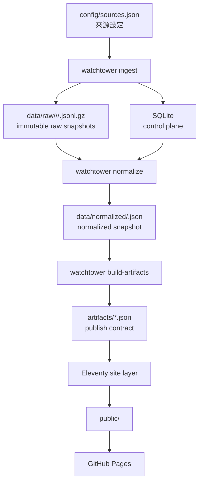

# ai-watchtower

`ai-watchtower` 是一個 **artifact-first 的 AI 情報出版系統**。  
它的工作不是把 AI 新聞做成無限捲動的 feed，而是把多來源、易重複、易焦慮的 AI 資訊流，整理成一條 **可定期更新、可追溯、可重建、可靜態發布** 的 intelligence pipeline。

## Highlights

- 以 **TypeScript + Node 24** 實作 pipeline 與 CLI
- `SQLite` 只作為 **control plane**，不承擔發布資料真相
- raw snapshots、normalized snapshot、publish artifacts 明確分層
- `Eleventy` 只讀 `artifacts/`，站點不再依賴 legacy snapshot
- `GitHub Pages` 是主要部署目標

## 目錄

- [系統目標](#系統目標)
- [核心架構](#核心架構)
- [資料分層與版控策略](#資料分層與版控策略)
- [CLI 介面](#cli-介面)
- [本機開發](#本機開發)
- [Artifact contract](#artifact-contract)
- [專案結構](#專案結構)
- [測試與驗證](#測試與驗證)
- [CI / Deploy](#ci--deploy)
- [為什麼不是把所有資料都塞進-sqlite](#為什麼不是把所有資料都塞進-sqlite)

## 系統目標

這個專案要解決的是：

- 抓取高價值 AI 資訊來源
- 用 deterministic pipeline 做 normalization / dedup / scoring / classification
- 按固定節奏重新產出 digest 與 ranking surfaces
- 保留 provenance，讓每個輸出都能追到來源與建構過程
- 用靜態站方式發布結果，而不是做一個高度耦合的全端 app

一句話說，這不是一般 RSS reader，而是一個 **資料產品導向的情報整理系統**。

## 核心架構



### 執行流程

1. `ingest`
   - 讀取 `config/sources.json`
   - 發送 feed requests
   - 更新 SQLite 的 source state / fetch runs / lineage index
   - 將每次抓取結果寫成 raw snapshot
2. `normalize`
   - 讀取 raw snapshots
   - canonicalize URL / timestamp / snippet
   - 生成 normalized snapshot
3. `build-artifacts`
   - 對 normalized items 做 scoring / classification / dedup / digest assembly
   - 驗證 artifact schema
   - 輸出 manifest 與 publish artifacts
4. `build`
   - Eleventy 讀取 `artifacts/`
   - 生成靜態網站

## 資料分層與版控策略

### 1. Control plane

路徑：

- `.data/watchtower.sqlite`

用途：

- source registry snapshot
- fetch state（`etag` / `last-modified` / last fetch status）
- run metadata
- fetch attempts
- lineage index

這層是 **runtime state**，不是資料版控對象。

### 2. Raw layer

路徑：

- `data/raw/<yyyy>/<mm>/<dd>/<source>/<run-id>.jsonl.gz`

用途：

- 保留每次抓取的原始 feed entries
- 做為可回放、可追溯的原始證據

這層預設不進 Git；如果未來需要長期版本化，優先考慮 object storage / DVC，而不是把大型 mutable DB 丟進版控。

### 3. Normalized layer

路徑：

- `data/normalized/<run-id>.json`
- `data/normalized/latest.json`

用途：

- 聚合 raw snapshots
- 統一 canonical URL、timestamp、snippet、fingerprint、content hash
- 做為 artifact build 的單一輸入

### 4. Publish layer

路徑：

- `artifacts/run-manifest.json`
- `artifacts/candidates.json`
- `artifacts/digests.json`
- `artifacts/dedup-groups.json`
- `artifacts/source-health.json`
- `artifacts/items.json`（站點 verification surface）

這層是 **正式 publish contract**。  
站點只讀這層；如果要做 Git-based review、diff、再現，應該看的也是這層。

## CLI 介面

目前 repo 的主要命令：

```bash
npm run watchtower -- <command>
```

或直接用 script alias：

```bash
npm run ingest
npm run normalize
npm run artifacts
npm run pipeline
```

### Commands

```bash
# 只抓來源並寫 raw snapshots / SQLite
npm run ingest

# 將 raw snapshots 聚合成 normalized snapshot
npm run normalize

# 從 normalized snapshot 產出 publish artifacts
npm run artifacts

# 依序執行 ingest -> normalize -> build-artifacts
npm run pipeline

# 先補齊 artifacts（若已有 normalized snapshot）再建站
npm run build

# 只執行 Eleventy site build
npm run build:site
```

## 本機開發

### 需求

- Node `>= 24`
- npm `>= 10`

### 安裝

```bash
npm ci
```

### 典型流程

```bash
npm run pipeline
npm run build
```

若 artifacts 已經存在，只想單獨重跑 Eleventy：

```bash
npm run build:site
```

本機開發模式：

```bash
npm run dev
```

清理快取與 build outputs：

```bash
npm run clean
```

## Artifact contract

### `run-manifest.json`

包含：

- `schemaVersion`
- `generatedAt`
- `runId`
- `configHash`
- normalized input hash
- raw snapshot 清單
- artifact hash 清單
- source fetch summary
- validation 結果

這是每次 build 的 provenance 索引。

### `candidates.json`

用於：

- 首頁 priority board
- ranked candidates 頁

內容聚焦在：

- canonical items
- score / score reasons
- classification
- dedup metadata

### `digests.json`

用於：

- briefing archive
- 每日 digest surfaces

### `dedup-groups.json`

用於：

- cluster / story overlap 檢查
- provenance / canonical member 檢視

### `source-health.json`

用於：

- sources 頁
- run health / fetch summary / operational trust

### `items.json`

用於：

- verification surface
- 檢查 normalized items 是否正確落地

## 專案結構

```text
config/
  sources.json              # 來源設定
data/
  raw/                      # immutable raw snapshots
  normalized/               # normalized snapshots
src/
  cli/                      # watchtower CLI
  contracts/                # schema / types / artifact contracts
  pipeline/                 # ingest, normalize, scoring, dedup, manifest
  _data/                    # Eleventy data adapters (read artifacts only)
  _includes/                # layouts / partials
  assets/                   # styles
artifacts/                  # publish contract
docs/
  architecture/             # 架構文件
tests/
  fixtures/                 # feed / snapshot fixtures
```

## 測試與驗證

執行測試：

```bash
npm test
```

目前測試面包含：

- normalization utilities
- scoring / classification rules
- artifact builder contract
- fixture-based ingest -> normalize integration

建議每次修改 pipeline 後至少重跑：

```bash
npm test
npm run pipeline
npm run build
```

## CI / Deploy

主要部署流程在 [`.github/workflows/pages.yml`](/Users/lynn/StudyProject/ai-watchtower/.github/workflows/pages.yml)。

GitHub Actions 目前做的事：

1. `npm ci`
2. `npm run pipeline`
3. `npm run build`
4. 上傳 `public/`
5. Deploy 到 GitHub Pages

這代表 CI 的責任分工是：

- pipeline 產生 artifacts
- Eleventy 產生 static output
- Pages 只負責發布 `public/`

## 為什麼不是把所有資料都塞進 SQLite

因為那樣會同時踩到三個問題：

1. **不可版控**
   - `.sqlite` 是 mutable binary，不適合做 diff / review / artifact audit
2. **資料邊界不清楚**
   - runtime state、raw evidence、publish outputs 會混成一層
3. **重建能力差**
   - 你很難回答「這個 digest 是根據哪一次抓取、哪一批輸入、哪個 config 生成的」

這個專案的目標不是讓 SQLite 成為一切，而是讓它退回應有的位置：  
**control plane，而不是 publish truth。**

真正應該被 review、被 diff、被拿來重建的是 `artifacts/`，而不是資料庫檔案。

## 延伸閱讀

- [Artifact-First Architecture](/Users/lynn/StudyProject/ai-watchtower/docs/architecture/artifact-first-architecture.md)
- [Pipeline spec](/Users/lynn/StudyProject/ai-watchtower/docs/pipeline.md)
- [Data model notes](/Users/lynn/StudyProject/ai-watchtower/docs/data-model.md)
