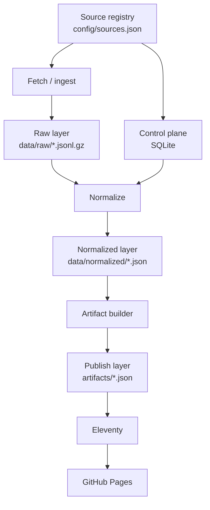

# Artifact-First Architecture

這份文件描述 `ai-watchtower` 重構後的核心邏輯：  
**SQLite 不是主資料層，artifacts 才是 publish contract。**

## 設計目標

系統要同時滿足四件事：

1. 可以定期更新
2. 可以回看某次輸出的來源與過程
3. 可以 deterministic 重建 publish 結果
4. 可以在不引入重型後端的情況下穩定發布

這四件事一起看，最佳形狀不是「全塞進 DB」，而是多層資料分工。

## 四層模型

### Control plane

責任：

- source state
- fetch metadata
- run metadata
- lineage index
- retry / conditional request 所需狀態

不該承擔：

- 完整 raw payload truth
- 發布層真相
- Git review 對象

### Raw layer

責任：

- 記錄每次抓取下來的 feed entries
- 提供可回放證據
- 支援 normalize 重跑

關鍵特性：

- immutable
- append-only
- path encoding 包含日期、來源、run id

### Normalized layer

責任：

- 聚合多次抓取結果
- 去除 tracking params
- 統一 timestamp / snippet / fingerprint / content hash
- 形成可供 publish 的 canonical snapshot

它不是最終發布層，但它是發布前的單一輸入。

### Publish layer

責任：

- 定義 site 與 review 應該看的正式輸出
- 把 digest / candidates / source health / dedup groups 收斂成穩定 schema
- 帶上 manifest、hash、validation 結果

這層應該是：

- 可 diff
- 可檢查
- 可版控
- 可被前端直接消費

## 為什麼這比「SQLite 一把抓」更好

### 1. 可追溯性更強

當某個 digest 看起來不對時，可以依序往回查：

- 它用了哪個 `runId`
- 該 run 用了哪些 raw snapshots
- normalized input hash 是多少
- artifact hash 與 validation 結果是什麼

這比打開 `.sqlite` 手動猜測來得乾淨得多。

### 2. 資料與發布責任分離

同一套 raw snapshots 可以反覆重跑 normalization 與 artifact build，而不必把站點層和 runtime state 綁死在一起。

### 3. Git review 有東西可看

如果資料只在 DB，你無法做高品質 code review / output review。  
如果 artifacts 是 JSON contract，你就能 review：

- 今天 digest 多了什麼
- ranking 為什麼改變
- dedup 結果是否合理
- source health 是否退化

## 站點層原則

Eleventy 只做一件事：

- **讀取 artifacts，渲染頁面**

它不應該：

- 偷讀 legacy snapshots
- 直接查 DB
- 把 pipeline 邏輯藏在 template 裡

這個邊界必須硬，不然資料層一亂，站點就會一起失真。

## Manifest 原則

每次 artifact build 都要留下 `run-manifest.json`，至少包含：

- `runId`
- `configHash`
- normalized input hash
- artifact hashes
- raw snapshot 清單
- source fetch summary
- validation 結果

這不是裝飾。  
它是這個系統從「看起來像資料產品」變成「真的能被信任的資料產品」的分水嶺。

## 後續擴張

這個架構刻意把 LLM summary 放在後面，原因不是它不重要，而是：

- 若底層資料 contract 不乾淨，summary 只會放大混亂
- 若 provenance 不完整，AI 輸出無法被審核
- 若 artifacts 不穩定，前端再漂亮也只是包裝

等 deterministic pipeline 穩定後，再加：

- AI summary
- AI digest synthesis
- object storage / DVC
- 更高頻更新
- richer UI / search / filters

那時候架構仍然成立，因為真正的邊界早就先立好了。
